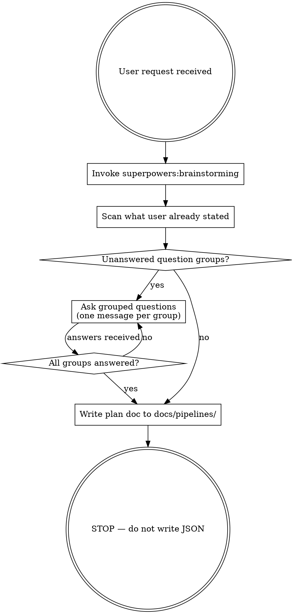
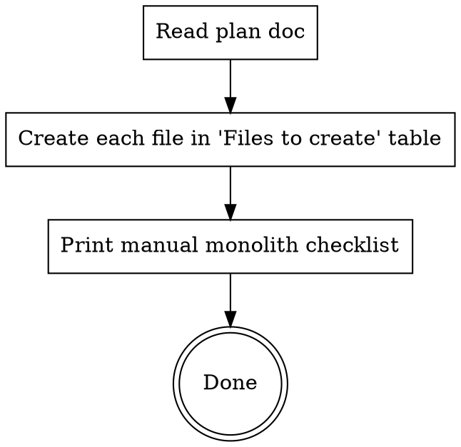

# ADF Pipeline Skill Rewrite Implementation Plan

> **For agentic workers:** REQUIRED SUB-SKILL: Use superpowers:subagent-driven-development (recommended) or superpowers:executing-plans to implement this plan task-by-task. Steps use checkbox (`- [ ]`) syntax for tracking.

**Goal:** Rewrite `~/.claude/skills/adf-pipeline/SKILL.md` to implement the two-mode (Plan / Build), adaptive-questions design approved in the brainstorm spec.

**Architecture:** Single skill file with two clearly separated modes. Plan mode invokes brainstorming, asks grouped questions, and writes a plan doc to the repo. Build mode reads that plan doc and creates JSON files, always flagging the ARM monolith update as manual. Brainstorming is only invoked in Plan mode.

**Tech Stack:** Markdown skill file, Graphviz flowchart (dot syntax), JSON snippets as reference

---

## Files

| Action | Path |
|--------|------|
| Overwrite | `~/.claude/skills/adf-pipeline/SKILL.md` |
| Template output location (reference only) | `docs/pipelines/YYYY-MM-DD-<pipeline-name>.md` in the ARM repo |

---

### Task 1: Write frontmatter + overview

**File:** `~/.claude/skills/adf-pipeline/SKILL.md` (full overwrite)

- [ ] **Step 1: Write frontmatter**

Replace the entire file with this opening block:

```markdown
---
name: adf-pipeline
description: Use when creating a new ADF pipeline, modifying an existing pipeline, or building a plan for Azure Data Factory work in an ARM template repository. Triggers on: "add pipeline", "create pipeline", "update pipeline", "new pipeline", any mention of ADF activities, ForEach, Copy activity, ExecutePipeline, TMO API ingestion, Salesforce sync, linked services, datasets, or triggers.
---

# ADF Pipeline Builder

## Overview

Two-mode skill for Azure Data Factory pipeline work in an ARM template repo.

| Mode | How to invoke | Output |
|------|--------------|--------|
| **Plan** (default) | Describe what you want to build or change | `docs/pipelines/YYYY-MM-DD-<name>.md` saved to repo |
| **Build** | "implement the plan at docs/pipelines/..." | JSON files created; monolith update printed as manual checklist |

**NEVER auto-edit `ARMTemplateForFactory.json`.** Always flag it as a manual step.
```

- [ ] **Step 2: Verify description does NOT summarise the workflow**

The description must only list trigger conditions — no mention of "brainstorm → questions → plan" flow. If any workflow summary crept in, remove it.

- [ ] **Step 3: Commit**

```bash
git -C ~/.claude add skills/adf-pipeline/SKILL.md
git -C ~/.claude commit -m "feat(adf-pipeline): start skill rewrite — frontmatter + overview"
```

---

### Task 2: Write Plan Mode flowchart + brainstorming invocation

**File:** `~/.claude/skills/adf-pipeline/SKILL.md` (append)

- [ ] **Step 1: Append Plan Mode section with flowchart**

```markdown
## Plan Mode



### Step 1 — Invoke brainstorming

**REQUIRED:** Invoke `superpowers:brainstorming` before any questions. It surfaces:
- What data moves from where to where
- Delta (incremental) or full load
- Whether a parent → child ForEach pattern is needed
- Which existing linked services / datasets can be reused
```

- [ ] **Step 2: Commit**

```bash
git -C ~/.claude add skills/adf-pipeline/SKILL.md
git -C ~/.claude commit -m "feat(adf-pipeline): add Plan Mode flowchart and brainstorming step"
```

---

### Task 3: Write adaptive question groups

**File:** `~/.claude/skills/adf-pipeline/SKILL.md` (append)

- [ ] **Step 1: Append question groups section**

```markdown
### Step 2 — Ask grouped questions (skip answered ones)

Scan the user's request first. For every group below, if all questions in that group are already answered, **skip the group entirely**. Send unanswered groups as one message per group.

#### Group 1 — Source & Target
- What is the data source? (TMO API / Salesforce / Azure SQL / Blob / other)
- What is the target? (Azure SQL / Salesforce / Blob)
- Is there an existing linked service + dataset for this connection, or does a new one need creating?

#### Group 2 — Load Pattern
- Delta (timestamp-based) or full load?
- Volume large enough to need a parent → child ForEach pattern, or is a single-pipeline copy fine?
- Is there a SQL control table/view that drives the batches? If so, what is its name?

#### Group 3 — Environment
- DEV only for now, or should PROD also be noted as future work in the plan?
- Should a trigger be included (`TGR_` file), and if so what schedule?

#### Group 4 — Dependencies
- Which SQL views, stored procs, or tables must exist before this pipeline runs?
- Any other pipelines this one calls or is called by?
```

- [ ] **Step 2: Commit**

```bash
git -C ~/.claude add skills/adf-pipeline/SKILL.md
git -C ~/.claude commit -m "feat(adf-pipeline): add adaptive question groups"
```

---

### Task 4: Write plan doc template

**File:** `~/.claude/skills/adf-pipeline/SKILL.md` (append)

- [ ] **Step 1: Append plan doc step and template**

````markdown
### Step 3 — Write the plan doc

Save to `docs/pipelines/YYYY-MM-DD-<pipeline-name>.md` in the ARM template repo. Use this template exactly:

```markdown
# Pipeline: PL_<NAME>_DEV
Date: YYYY-MM-DD
Status: planned

## What it does
One paragraph: source → transformation → target.

## Files to create
| File | Type | Notes |
|------|------|-------|
| pipeline/PL_LOAD_X_DEV.json | Pipeline | Parent, ForEach pattern |
| pipeline/PL_CHILD_LOAD_X_DEV.json | Pipeline | Child, does the copy |
| dataset/DS_X_DEV.json | Dataset | Reuses LS_AzureSql_CAL_DEV |

## Files to modify
| File | Change |
|------|--------|
| linkedService/LS_NEW.json | New — create fresh |

## Load pattern
- Type: delta / full
- Control table / view: `vw_<name>`
- Batch key: `key_value`, offset: `off_set`

## Environment variants
- [x] DEV (`_DEV`) — implement now
- [ ] PROD (no suffix) — future work
- [ ] Full load (`_FULL`) — future work

## Manual steps after build
- [ ] Add each new resource to `ARMTemplateForFactory.json` → `resources[]`
- [ ] If using linked templates: add to correct `ArmTemplate_N.json` chunk
- [ ] Add any new secureString params to both parameter files

## Dependencies
- SQL objects that must exist before first run
- Existing linked services / datasets being reused
```

**After writing the doc:** stop. Do not create any JSON files in Plan mode.
````

- [ ] **Step 2: Commit**

```bash
git -C ~/.claude add skills/adf-pipeline/SKILL.md
git -C ~/.claude commit -m "feat(adf-pipeline): add plan doc template"
```

---

### Task 5: Write Build Mode section

**File:** `~/.claude/skills/adf-pipeline/SKILL.md` (append)

- [ ] **Step 1: Append Build Mode section with flowchart**

```markdown
## Build Mode

Triggered when the user says: "implement the plan at docs/pipelines/..."



### Steps

1. **Read** the plan doc at the path provided
2. **Create** every file listed in the "Files to create" table — use the skeletons below
3. **Print** this checklist at the end (fill in the actual file names):

```
## Manual steps — complete these yourself

- [ ] Open ARMTemplateForFactory.json
- [ ] Add each new resource object to the `resources[]` array:
      - pipeline/PL_<NAME>_DEV.json → copy the JSON and paste as a resource entry
      - pipeline/PL_CHILD_<NAME>_DEV.json → same
      - dataset/DS_<NAME>_DEV.json → same
- [ ] If using linked templates: add resources to the correct ArmTemplate_N.json chunk
- [ ] If new secureString params were added: update both parameter files
```

**NEVER edit `ARMTemplateForFactory.json` automatically.** It contains all resources for the factory; a bad edit breaks the entire deployment.
```

- [ ] **Step 2: Commit**

```bash
git -C ~/.claude add skills/adf-pipeline/SKILL.md
git -C ~/.claude commit -m "feat(adf-pipeline): add Build Mode section"
```

---

### Task 6: Write JSON skeletons + naming reference

**File:** `~/.claude/skills/adf-pipeline/SKILL.md` (append)

- [ ] **Step 1: Append pipeline JSON skeleton**

````markdown
## JSON Skeletons

### Pipeline (parent or child)

```json
{
    "name": "[concat(parameters('factoryName'), '/PL_YOUR_PIPELINE_NAME')]",
    "type": "Microsoft.DataFactory/factories/pipelines",
    "apiVersion": "2018-06-01",
    "properties": {
        "description": "One-line description of what this pipeline does",
        "activities": [],
        "parameters": {},
        "variables": {},
        "annotations": []
    },
    "dependsOn": []
}
```

### Lookup → ForEach → ExecutePipeline (parent pattern)

```json
[
  {
    "name": "LOOKUP_CONTROL_TABLE",
    "type": "Lookup",
    "dependsOn": [],
    "typeProperties": {
      "source": {
        "type": "AzureSqlSource",
        "sqlReaderQuery": "select * from vw_<name> order by key_value, off_set asc",
        "queryTimeout": "02:00:00",
        "partitionOption": "None"
      },
      "dataset": { "referenceName": "DS_AZURE_SQL_CAL_DEV", "type": "DatasetReference" },
      "firstRowOnly": false
    }
  },
  {
    "name": "ForEach_Batches",
    "type": "ForEach",
    "dependsOn": [{ "activity": "LOOKUP_CONTROL_TABLE", "dependencyConditions": ["Succeeded"] }],
    "typeProperties": {
      "isSequential": true,
      "items": { "value": "@activity('LOOKUP_CONTROL_TABLE').output.value", "type": "Expression" },
      "activities": [{
        "name": "EXEC_CHILD",
        "type": "ExecutePipeline",
        "typeProperties": {
          "pipeline": { "referenceName": "PL_CHILD_<NAME>_DEV", "type": "PipelineReference" },
          "parameters": {
            "key_value": { "value": "@item().key_value", "type": "Expression" },
            "off_set":   { "value": "@item().off_set",   "type": "Expression" }
          }
        }
      }]
    }
  }
]
```

### REST API → Blob → Azure SQL (TMO ingest child pattern)

- Activity 1: `Copy` — `RestSource` → `JsonSink` to Blob (stage raw JSON)
- Activity 2: `Copy` — `JsonSource` from Blob → `AzureSqlSink` with stored proc

### Salesforce → Azure SQL (SF delta child pattern)

- Activity 1: `Copy` — `SalesforceSource` (SOQL query with watermark) → `AzureSqlSink`
````

- [ ] **Step 2: Append naming conventions + environment cheat sheet**

```markdown
## Naming Conventions

| Resource | Pattern |
|----------|---------|
| Parent pipeline | `pipeline/PL_<VERB>_<ENTITY>_DEV.json` |
| Child pipeline | `pipeline/PL_CHILD_<VERB>_<ENTITY>_DEV.json` |
| Dataset | `dataset/DS_<NAME>_DEV.json` |
| Linked service | `linkedService/LS_<SYSTEM>_DEV.json` |
| Trigger | `trigger/TGR_<ENTITY>.json` |

All names uppercase with underscores.

## Environment Suffix Cheat Sheet

| Suffix | SQL database | Linked service | Dataset |
|--------|-------------|----------------|---------|
| `_DEV` | `cal_bi_analytics_dev` | `LS_AzureSql_CAL_DEV` | `DS_AZURE_SQL_CAL_DEV` |
| `_FULL` | `cal_bi_analytics` | `LS_AzureSql_CAL_FULL` | `DS_AZURE_SQL_CAL_DYN_FULL` |
| none | `cal_bi_analytics` | `LS_AzureSql_CAL` | `DS_AZURE_SQL_CAL` |

DEV variant is always implemented first. FULL and no-suffix (prod) are future work unless explicitly requested.
```

- [ ] **Step 3: Commit**

```bash
git -C ~/.claude add skills/adf-pipeline/SKILL.md
git -C ~/.claude commit -m "feat(adf-pipeline): add JSON skeletons and naming reference"
```

---

### Task 7: Write common mistakes + final review

**File:** `~/.claude/skills/adf-pipeline/SKILL.md` (append)

- [ ] **Step 1: Append common mistakes**

```markdown
## Common Mistakes

| Mistake | Fix |
|---------|-----|
| Editing `ARMTemplateForFactory.json` automatically | Never. Always a manual step. |
| Creating a new linked service when one already covers the connection | Check `linkedService/` first |
| Implementing FULL/PROD variant in the same session without being asked | Note as future work only |
| `_DEV` and prod variants diverging after separate edits | Apply the same logical change to both when you do update prod |
| Committing parameter files with secrets filled in | Secrets stay blank; supply at deploy time via `--parameters` |
| Forgetting to update both parameter files when adding a new secureString | `ARMTemplateParametersForFactory.json` and `linkedTemplates/ArmTemplateParameters_master.json` must stay in sync |
```

- [ ] **Step 2: Read the full file and verify against the design spec**

Read `~/.claude/skills/adf-pipeline/SKILL.md` and check each item:

- [ ] Description has no workflow summary — only trigger conditions
- [ ] Plan mode flowchart is present and terminates at "STOP — do not write JSON"
- [ ] Build mode flowchart is present and ends with manual checklist print
- [ ] `superpowers:brainstorming` is marked REQUIRED in Plan mode
- [ ] All 4 question groups present with skip instruction
- [ ] Plan doc template is complete — no TBDs
- [ ] JSON skeletons: pipeline, parent pattern, TMO pattern, SF pattern all present
- [ ] Naming table present
- [ ] Environment cheat sheet present
- [ ] Monolith warning appears in both Overview and Build Mode

- [ ] **Step 3: Final commit**

```bash
git -C ~/.claude add skills/adf-pipeline/SKILL.md
git -C ~/.claude commit -m "feat(adf-pipeline): complete skill rewrite — two-mode adaptive design"
```
